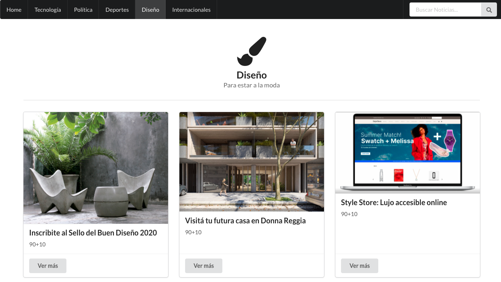

# News Room

App created as part of a React Course by Acamica + Globant, the objective of this application is to use and understand the basics of State management, API data fetching and Redux.

Small preview of the page:



## Stack Used

- React (Bootstraped with [Create React App](https://github.com/facebook/create-react-app))
- React-Router
- Redux
- Semantic-UI for styling.

### How to launch the application:

Clone the repository, install package dependencies and run with Yarn

```
git clone ...

npm install

yarn start
```

Yarn runs the app in the development mode.\
Open [http://localhost:3000](http://localhost:3000) to view it in the browser.

Or check this codesandbox: https://codesandbox.io/s/github/r-vasquez/React_news_room
